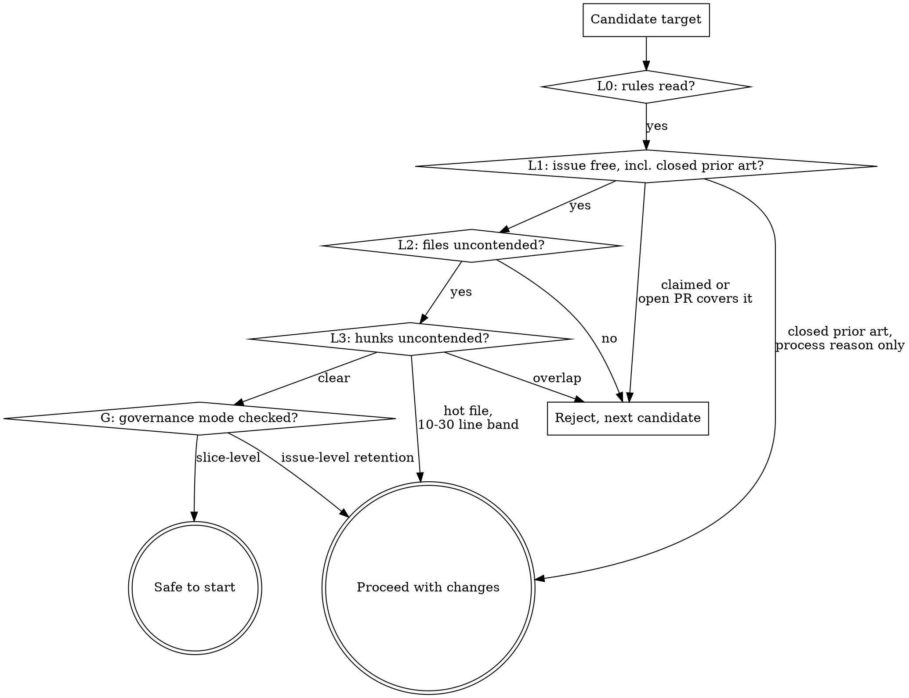

# OSS Contribution Recon

## Overview

In a high-traffic repo (roughly 10k+ stars, dozens of merges a week) the scarce resource is not skill — it is **an unclaimed piece of work in a file nobody else is editing, on an issue whose governance will let your PR survive**. Most rejected PRs in these repos die for queue, governance, and collision reasons, not code quality.

**Core principle: prove the target is free before writing a line. Free means free at the issue level, the file level, the hunk level, AND under the repo's own closing rules.**

This skill covers only the part that decides whether a contribution will pay off; pair it with any end-to-end contribution workflow.

**Measurements that must not be wrong are scripts, not prose.** The scripts in `scripts/` (next to this file) do the counting — merge rates, file contention, issue history, PR tracking — because hand-written `gh` one-liners got each of these wrong in practice. Use them instead of rewriting the queries. They need only Python 3.10+ and an authenticated `gh`; each prints its usage with `--help`. Paths below are relative to this skill's base directory — call the scripts by absolute path from whatever repository you are working in.

| Script | Answers |
|--------|---------|
| `scripts/issue_prs.py owner/repo N` | Every PR that ever referenced issue N, any state, with why the closed ones died (L1) |
| `scripts/contention_map.py owner/repo --build` | Which files and line ranges every open PR touches (L2, L3) |
| `scripts/base_rate.py owner/repo` | How often outside PRs merge here, and why the rest were closed (briefing) |
| `scripts/pr_status.py` | State of your own open PRs after submission |

## When to Use

Use before choosing a target when:

- The repo merges many PRs per week and has a visible contributor crowd
- `good first issue` items all carry comments like "I'd like to work on this"
- You are joining an umbrella refactor issue that many people are slicing
- A previous PR of yours was closed as duplicate, stale, or conflicted

Do NOT bother when:

- The repo is small or low-traffic — just open the PR
- A maintainer invited or assigned **you**, for **this** slice (see the misattribution warning in L1)
- The change is a genuine one-line docs typo

## L0 — Read the Rules Before the Code

Do this first, not as an afterthought before opening the PR. What you find here changes what evidence you need to collect and can invalidate a target outright.

**Start from the repo's rule file if one exists:** `repos/<repo>.md` next to this skill (for example `repos/dify.md`). It records what earlier rounds learned the hard way: disclosure lines, open-PR limits, local commands that differ from CI. Each file carries the date it was checked. Re-verify any rule older than about a month against the live documents below, and update the file when you learn something new. For a repo with no file, copy `repos/_template.md` after finishing L0.

```bash
gh api "repos/<owner>/<repo>/contents/.github/pull_request_template.md" \
  -H "Accept: application/vnd.github.raw"
gh api "repos/<owner>/<repo>/contents/CONTRIBUTING.md" \
  -H "Accept: application/vnd.github.raw" | head -80
```

Extract, specifically:

- **Issue-linking syntax.** `Fixes #N` auto-closes on merge. On a long-running umbrella issue that is wrong and disruptive — the convention is usually a bare `#N` or `part of #N`. **Verify against a merged PR's actual body text, not the template's suggestion.**
- **AI-disclosure requirement.** Some repos mandate a line like `From <Tool Name>` for agent-authored PRs. If the template says it, it is mandatory, not ceremony. Omitting it is a policy violation.
- **Sign-off / DCO.** `git commit --signoff` required? Read the whole file, not a keyword grep — the clause may not use the word "DCO".
- **"You must be assigned."** Check whether assignment is actually enforced in this repo's PR history, or whether commenting a claim is the real norm. Usually the latter.

## The Freedom Check

Four outcomes, not two. Forcing a binary here produces both false rejections of good targets and false confidence in doomed ones.



**"Proceed with changes"** means the target is real but something changes *how* you open the PR, not *whether* you do: claim it by comment first, adopt a specific link syntax, plan a same-day rebase, or accept a governance risk knowingly.

### L1 — Issue level, including closed prior art

A label is not a status, and **open PRs are not the whole picture**. Look at every state.

```bash
# Full comment list, not the last few — on long umbrella issues the decisive
# comment is often buried in the middle.
gh issue view <n> -R <owner>/<repo> --json comments \
  --jq '.comments[] | "[\(.author.login)] \(.createdAt[:10]): \(.body[:250])"'

# Every PR that referenced the issue, ANY state, with the last comment on each closed one.
python scripts/issue_prs.py <owner>/<repo> <n>
```

The script reads the issue timeline's cross-references. A search for the number misses PRs that only mention the issue in their body, and matches unrelated text.

| Finding | Verdict |
|---------|---------|
| Someone claimed your exact slice in a comment | Reject |
| An **open** PR covers it | Reject |
| A **closed, unmerged** PR did the identical change, closed for a *process* reason (duplicate rule, queue, conflict) with no code complaint | **Proceed with changes** — the shape is validated, the process gate is not cleared. Clear it deliberately. |
| A closed PR was rejected on the *merits* ("we don't want this", "internal plan conflicts") | Reject — the maintainers said no to the idea |
| Nothing found, code still unfixed on `main` | Continue to L2 |

**Misattribution warning.** A maintainer's "go ahead" / "create a pr" only counts as permission for *your* slice if it was written in direct reply to *your* comment about *your* slice. Check the reply target. Encouraging language addressed to someone else, months ago, is not your green light.

### G — Governance mode

Do this alongside L1, because it can override every file-level result.

Read why recent outside PRs actually died — the script prints the last comment on each closed-unmerged one:

```bash
python scripts/base_rate.py <owner>/<repo> --days 30 --show-closed 15
```

Bot comments count: an automated "first-time contributors can have at most 1 open pull request" closure is a governance rule, not a verdict on the code.

**The decisive distinction:** if a closing message names a *retained PR* rather than a *conflicting file*, the repo enforces **one PR per issue regardless of which files each PR touches**. In that mode L2/L3 file-freedom is necessary but not sufficient — check whether the issue's single retained slot is occupied, and plan to claim your slice by comment to establish a FIFO timestamp.

| Rule | Consequence | Counter |
|------|-------------|---------|
| Duplicate-PR / FIFO retention at **issue** level | One PR survives per issue; the rest close regardless of files or quality | Claim by comment for a timestamp; be fast; re-check the issue daily |
| Close-on-conflict | Any conflict with base closes the PR, and rebasing may not reopen it | Rebase before opening, re-check daily, resolve same-day |
| Close-on-stale-CI | Red CI left unfixed gets swept | Fix CI the same day |
| Maintainer roadmap conflict | "We have an internal plan for this" | Prefer files maintainers are not actively rewriting — L2 catches this |

These rules fire in periodic sweeps, not continuously. A rule that last fired a month ago is dormant, not dead.

### L2 — File level: the contention map

Build once per repo, reuse for every candidate. Highest-value step in this skill.

```bash
python scripts/contention_map.py <owner>/<repo> --build          # caches to ~/.cache/oss-pr-recon/
python scripts/contention_map.py <owner>/<repo> --check path/you/want.py --check other/file.py
```

**A keyword search over PR titles and bodies is NOT a substitute.** PR descriptions almost never enumerate the files they touch, so a text search silently misses the PRs most likely to collide with you. Only the file list answers this question.

**Check the test file you will edit, not just the source file.** Several PRs fixing different bugs in one module all add tests to the same test file, so it collides more often than the source does.

**Neither is `gh pr view --json files`.** It stops at 100 files per PR, so the large refactor PRs — the ones most likely to touch your file — are exactly the ones it truncates (one 234-file PR came back as 100). The script pages through the REST file list instead.

One API call per open PR. **Start the build in the background and do L0, L1 and G while it runs** — that is the intended sequencing, not an optimization. `--check` warns when the map is older than a day or when some PRs failed to fetch.

If you genuinely cannot afford the full map, degrade explicitly rather than substituting a weaker method:

- Scope it — only PRs touching the same top-level directory, or the 50 most recently updated
- **State the coverage you actually achieved** in your notes and in the PR if relevant: "checked the 40 most recent open PRs, not all 180"
- Treat a reduced map as *no evidence of freedom*, not evidence of freedom. It can reject a target; it cannot clear one.

To surface work nobody is near, pass every candidate file as its own `--check`; the `COLD` lines are your shortlist.

### L3 — Hunk level

A shared file is only fatal when you edit the same region. Give the base-branch lines you plan to change:

```bash
python scripts/contention_map.py <owner>/<repo> --check path/you/want.py --line 120 --line 245
```

For each competing PR it prints the base-branch line ranges its hunks touch and a verdict from the table below. Base-branch numbers are used because both PRs are written against the same base, so they are directly comparable. `UNKNOWN` means GitHub sent no patch (binary or very large file) — read that PR's diff yourself.

| Distance from your edit | Verdict | Action |
|-------------------------|---------|--------|
| Overlapping, or within ~10 lines | Hard conflict | Reject, or wait for the other PR to land |
| 10–30 lines, or same function | **Hot file** — not a git conflict, but two PRs editing one function the same week | Proceed with changes: check whether the competing PR is near merging (approvals, recent activity), open yours anyway, expect a same-day rebase |
| Over ~30 lines and a different function | Effectively distinct | Proceed normally |

Also check whether the competing PRs are duplicates *of each other* — two open PRs doing the same cleanup means one is already doomed, which changes the odds.

## When the Issue List Is Farmed Out

If every actionable issue is claimed within a day or two, stop shopping and **source your own work from the code**. A bug you found yourself has zero competition because you created the item.

Hunt where review was thinnest — code merged in the last two weeks:

```bash
git log upstream/main --since="14 days ago" --name-only --pretty=format: -- <src-dir> \
  | grep -v '^$' | sort | uniq -c | sort -rn | head -25
```

Read the newest extractions and refactors looking for:

- **Internal inconsistency** — one function treating the same value two different ways
- **Checks dropped in a refactor** — diff the old call site against the new service or repository
- **A correct idiom that exists elsewhere in the repo but was not used here**
- **Empty input assumed non-empty** — `xs[0]`, `xs[-1]`, `max(xs)` on a list a public method accepts from its caller. Small, provable with a two-line test, and rarely contested.
- **A value that can be `None` reaching code that assumes it is not** — trace it to the upstream call or default that produces `None` before calling it a bug

Internal inconsistency is the strongest report available: it is a defect regardless of whether anyone can trigger it, so it cannot be argued away on impact.

### Prove it before filing

**1. Try to kill your own finding first.**

Start by reading **the whole function you want to change, plus every docstring, comment, and sibling function in the same file** — not just the two snippets you noticed. An "internal inconsistency" is falsified far more often by a comment three lines up explaining that the inconsistency is deliberate than by anything structural. If the function has a docstring, quote it in your notes before concluding it is a bug.

Then look for a test that pins the behavior you are calling wrong. A passing test asserting the "buggy" output is the strongest possible prior art against you.

```bash
grep -rn "def test_.*<function_name>\|<function_name>(" <tests-dir>/ | head
```

Then check the layer below: for a "missing constraint" claim, the model *and* the migrations; for a "this cannot happen" claim, every writer.

```bash
grep -rniE "unique|constraint|index" <migrations-dir>/ | grep -i <table>
```

Finally, search for the idea itself, not just your file. Maintainers may have already rejected this change:

```bash
gh api "search/issues?q=repo:<owner>/<repo>+<the+idea+in+words>" \
  --jq '.items[] | "#\(.number) [\(.state)] \(.title)"'
```

A closed PR proposing your exact idea, with a maintainer explaining *why not*, tells you the constraints your version must satisfy — or that the answer is simply no.

**2. Do git archaeology to prove reachability.** A defect only matters if data can reach it. Find when the guard was introduced and whether old data was backfilled.

```bash
git log --oneline -S 'the normalizing expression' -- <file>
git show --stat <that-commit> | grep -i migration
```

No backfill migration means pre-existing rows still violate the invariant today. That converts "theoretical" into "real" — the difference between a report that gets fixed and one that gets closed.

**3. Write a failing test before the fix.** Run it and paste the real assertion error into the issue. Maintainers verify in thirty seconds instead of arguing.

**4. State the limits yourself.** Name what you could not prove and what the fix does not cover. A scope note you volunteer reads as rigor; the same limitation found by a reviewer reads as overclaiming.

### Now attack your own fix with the same rigor

Proving the bug is not proving the patch. Ask, for every guard you loosen or condition you add:

- **What input newly passes this check that did not before?** Enumerate the cases, including the degenerate one — empty, unchanged, self-referential, already-correct.

- **What runs after the check?** Do not answer this by scanning for the words delete, cascade, revoke, purge. Ask it unqualified: *does the result of this call ever get compared, branched on, used to resolve a permission or an identity, or assumed to be unique?* Trace **every** caller, not the one you already know about:

  ```bash
  grep -rn "<function_name>(" --include=<ext> . | grep -v <tests-dir>
  ```

  A newly-passing input reaching an authorization, identity, or access-control decision is a regression even though nothing is deleted.

- **Am I loosening a uniqueness or equality assumption?** Exact match to normalized match, single value to range, strict to lenient — any of these can let two things that were previously distinguishable collide. Check whether anything downstream assumes exactly one result (`scalar_one`, `.one()`, `[0]`, an unguarded unpack). Broadening the match can turn a request that used to be served into one that raises.

- **Did I preserve the old behavior for every input that is not the bug?** A fix should change the buggy case and nothing else.

"It can only match more, so it cannot break anything" is not evidence. It is precisely the claim you are supposed to be trying to disprove.

Write a test for the degenerate case specifically. Reviewers and review bots find these fast, and finding it yourself is the difference between a clean merge and a round trip.

### If you changed a signature, enumerate callers by identity — never by syntax

Changing a function's parameters, or adding a decorator that injects one, breaks every caller that does not go through the normal path. Tests are the usual casualty: they reach past decorators, call unbound methods, or patch the function in place.

**The trap is verifying with a pattern instead of a fact.** A grep for one call spelling silently reports "no callers" while a differently-spelled call sits right there. The same semantics have many syntaxes:

```python
unwrap(api.post)(api, session)          # direct
handler = unwrap(api.post); handler(…)  # two-step, invisible to a `unwrap(…)(` pattern
getattr(api, "post").__wrapped__(…)     # attribute access
Api.post(instance, …)                   # unbound, skips the instance decorator entirely
monkeypatch.setattr(Api, "post", …)     # replaces it outright
```

So resolve callers by **identity, not spelling**: find every file that mentions the class or function at all, then for each mention locate the invocation and check the argument list against the new signature.

```bash
# 1. every file that references the symbol, tests included
grep -rln "<ClassOrFunction>" <tests-dir> <src-dir> --include=<ext>

# 2. in each, find where the callable is bound AND where it is invoked —
#    they are often many lines apart, so a single-line regex will miss the pair
```

Then assert the result as a count, not a glance: *N call sites found, N conform to the new signature, 0 remaining*. A verification that cannot produce that number has not verified anything.

Two more things this class of change tends to break, both worth checking explicitly:

- **Decorator-injected values are unavailable to unwrapped callers.** A test that bypasses the decorator must construct the value itself, from the same source the decorator reads (the request body, the session factory), so the test's own inputs stay unchanged.
- **Not every same-named symbol is yours.** Two modules can both export `MessageFeedbackApi`. Confirm the import path before "fixing" a caller you never touched.

## Pre-Submission Briefing (required before pushing)

Never open a PR without first telling the author what the odds are and why. Estimate from this repo's own base rate, not from a feeling.

**Measure the base rate** — external, non-bot PRs closed in the last 30 days:

```bash
python scripts/base_rate.py <owner>/<repo> --days 30 --show-closed 15
```

**Do not measure it with the search API.** The search `closed:` date filter silently drops many PRs that were closed without merging, while still finding the merged ones, so the rate comes out high. Same repo, same 30 days: search found 261 merged and 25 closed-unmerged (91%); the REST pull list found 261 and 113 (69.8%). A PR closed on the 29th was missing from `closed:>=` the 3rd, yet `is:closed` alone found it. On another repo search said 87% against a true 49.7%.

**Do not trust `author_association` alone for "external".** It only sees *public* organization membership, so employees show up as `CONTRIBUTOR`, and project bots that are plain user accounts (`HaystackBot`) pass a `[bot]` filter. On one repo those two errors turned a 48.8% outside-contributor rate into 65.5%. The script drops anyone who merged a PR in the window and any login ending in "bot", and prints whom it dropped.

**Campaign rates count only your kind of change.** On an umbrella issue, the merge rate of its PRs applies to you only if the merged ones made the same kind of change you are making. Filter by diff before quoting a number:

```bash
python scripts/issue_prs.py <owner>/<repo> <campaign-issue> --diff-match '^-.*\bdb\.session\b'
```

A campaign where every merged PR removed a call that your PR does not touch has told you nothing about your PR, however high its rate.

**Then read why the closed ones died** — this is what turns a base rate into a forecast. Pull the last comments on each and classify: duplicate-guard bot, scope too large, feature needing buy-in, maintainer citing an internal/private decision, stale CI, conflict. For each cause, state whether your PR shares the trait.

Report in this shape:

| Field | Content |
|-------|---------|
| Target | repo / issue number / one-line defect |
| Base rate | merged N vs closed M over 30d = X% |
| Death causes | each of the M, and whether you share the trait |
| Estimate | your % and every deduction, itemized |
| Hard gates | CLA, DCO, release note, AI disclosure — flag which need the author personally |
| Uncontrollable | maintainer discretion, hot files, decisions made in private repos |
| Abort line | what would make you recommend not submitting |

Two rules:

- **Deduct only for causes you actually share.** A repo that closes feature PRs tells you nothing about your bug fix.
- **A gate the author must clear personally is not a probability, it is a precondition.** An unsigned CLA makes the odds zero, not lower. Say so separately.

## Grep Discipline

Substring matches manufacture phantom targets.

```bash
grep -rn "db\.session"          # WRONG: also matches core.db.session_factory
grep -rnE "\bdb\.session[.(]"   # RIGHT: only real attribute or call use
```

Always re-read one match in full context before trusting a count. When a source claims "N call sites", verify N yourself repo-wide, not just in the file you were told about.

## Extract the Merged-PR Recipe

Do not invent a PR shape. Copy the one that already merges here.

```bash
python scripts/issue_prs.py <owner>/<repo> <campaign-issue> --no-comments | grep MERGED

gh pr view <a-merged-one> -R <owner>/<repo> \
  --json title,body,additions,deletions,changedFiles
```

Copy exactly: title prefix, issue-reference syntax, typical diff size, which checklist boxes get ticked, whether tests are expected. Prefer contributors with several merges; their shape is proven. If no merged PR does your exact kind of change, say so rather than inferring shape from a closed one.

## Attribution and Disclosure

**Repository policy overrides every default — including this skill's and any workflow skill's.**

- **Commit messages**: no AI attribution. No `Co-Authored-By`, no `Generated by`. Default, and matches most projects.
- **PR description**: obey `.github/pull_request_template.md`. Some repos *require* agent disclosure. Omitting it there is a policy violation, not privacy.

Different places, so there is no conflict.

## After Submission

Track every open PR in one pass rather than opening them one by one:

```bash
python scripts/pr_status.py --since-days 3
```

It prints merge state, CI counts with failing check names, review decision, and human comments since the cutoff, then your merged count over the last 12 months outside your own repositories.

- **Red CI**: fix it the same day; some repos sweep stale red PRs.
- **No response**: ping only after the minimum wait the repo states (the rule file or PR template), once, with one sentence on what the PR fixes and that CI is green.
- **A maintainer is merging other PRs but not yours**: they are active, so silence is a choice or a backlog, not an absence. Don't ping twice; re-read whether your PR matches what they are merging (L1, "Campaign rates").

## Quick Reference

| Question | Command |
|----------|---------|
| What are the repo's rules? | `repos/<repo>.md`, then the PR template + CONTRIBUTING.md (L0) |
| Is this issue really free? | `scripts/issue_prs.py R <n>` — every state |
| Did someone already try this and get closed? | same script; read the last comment for merits vs process |
| Does this repo close on governance, not content? | closing comments naming a *retained PR* (G) |
| Which files are contended? | `scripts/contention_map.py R --build`, then `--check <path>` (L2) |
| Will my edit conflict? | `--check <path> --line <n>` against the distance table (L3) |
| What are my odds here? | `scripts/base_rate.py R` — never the search API |
| Does the campaign rate apply to me? | `scripts/issue_prs.py R <n> --diff-match <regex>` |
| What shape merges here? | `gh pr view <merged-pr> --json title,body,additions` |
| What happened to my PRs? | `scripts/pr_status.py` |
| Where is review thinnest? | `git log --since="14 days ago" --name-only` |
| Can old data reach my bug? | `git log -S 'expr'` then check for a migration |
| What does my fix newly let through? | enumerate degenerate inputs; check what runs downstream |

## Common Mistakes

| Mistake | Consequence | Fix |
|---------|-------------|-----|
| Trusting the `good first issue` label | Target was claimed weeks ago in a comment | Read the full comment list, not labels, not the last three |
| Searching only **open** PRs | Miss a closed PR that did your exact change and reveals the real gate | `issue_prs.py` covers every state |
| Treating a maintainer's "go ahead" to someone else as yours | You skip a claim step everyone else took | Check the reply target |
| Checking the issue but not the files | Maintainer is mid-refactor in your file; conflict closes you | Build the contention map |
| Keyword-searching PRs instead of listing files | Colliding PRs are invisible — bodies don't name files | `contention_map.py` |
| Listing files with `gh pr view --json files` | Big PRs truncated at 100 files; the collision hides in the cut | REST file list with pagination (the script) |
| Measuring merge rate with the search API | Closed-unmerged PRs undercounted; rate inflated by 20+ points | `base_rate.py` |
| Calling everyone with `CONTRIBUTOR` association "external" | Employees and user-account bots counted as outsiders; rate inflated | `base_rate.py` drops mergers and `*bot` logins |
| Quoting a campaign's merge rate for a different kind of change | Confident estimate, PR off-scope for the campaign | `issue_prs.py --diff-match` |
| Reduced map treated as a clean bill of health | False confidence | A partial map can reject, never clear; state your coverage |
| Checking file names but not hunks | Rejected a safe target, or accepted a doomed one | Use the L3 distance table |
| Assuming file freedom is enough | Issue-level retention closes you anyway | Run G |
| Unanchored grep | Phantom targets from substring matches | `\bfoo\.bar[.(]`, verify one match by eye |
| Filing without checking the layer below | Report dies because a constraint already prevents it | Check migrations and every writer |
| Filing without archaeology | Dismissed as theoretical | `git log -S` plus backfill check |
| Proving the bug but not the patch | Reviewer finds your fix's regression | Enumerate what newly passes and what runs after |
| Grepping one call spelling after a signature change | The other spellings break in CI, not locally | Resolve callers by symbol identity, then count conforming sites |
| Inventing a PR format | Bounced on process | Copy a merged PR's exact shape |
| Applying "never disclose AI" to a repo that mandates it | Policy violation | The repo's template wins |

## Red Flags — Stop and Re-Check

- "The label says good first issue, that's enough"
- "No **open** PR, so it's free" — check closed ones; that is where the gate is documented
- "A maintainer said go ahead" — to whom, about what, when?
- "Nobody commented, so it's free" — a PR can exist with no comment on the issue
- "It's a different concern, so sharing the file is fine" — check hunks, then check governance mode
- "I searched the PRs for the keyword and found nothing" — you searched text, not files
- "I only scanned 40 of 180 PRs, but it's probably representative" — that clears nothing
- "grep found it, ship it" — check for substring matches
- "The impact is obvious, I don't need a repro" — write the failing test
- "This is probably still broken today" — prove it with archaeology
- "The fix is three lines, it can't break anything" — enumerate what newly passes the guard
- "I grepped for callers and found none" — you grepped for one spelling; enumerate by symbol identity and report the count
- "Search says this repo merges 90% of outside PRs" — search undercounts closed ones; run `base_rate.py`
- "The campaign merges almost everything, so mine will merge" — only if yours is the same kind of change; filter with `--diff-match`
- "I'll just write the query inline, it's quicker" — the inline queries are how the counts went wrong; use the scripts

Each of these produced a wasted target, a missed gate, or a review round-trip in the sessions this skill came from.
