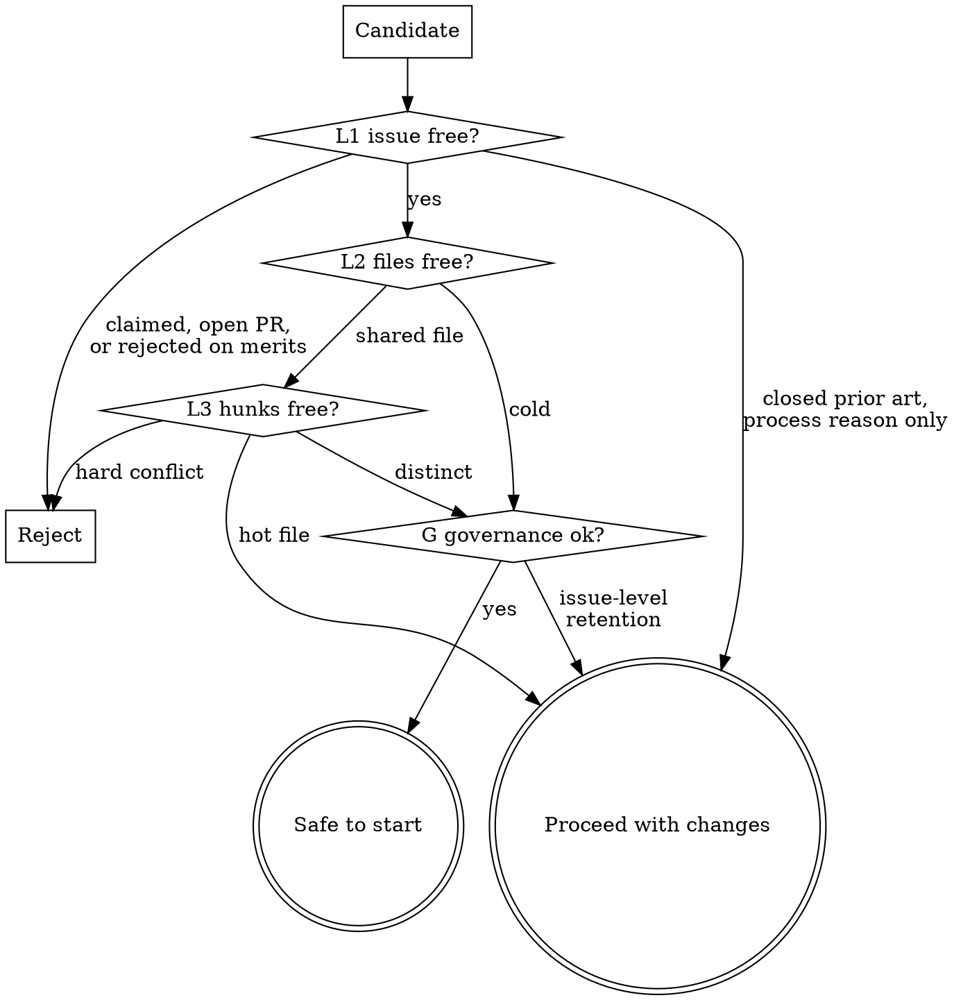

# Target recon (phase 3)

## Overview

In a high-traffic repository the scarce resource is not skill: it is **an unclaimed piece of work in lines nobody else is editing, on an issue whose governance will let the PR survive**. Most rejected PRs there die for queue, governance and collision reasons, not code quality.

**Prove the target is free before writing a line: free at the issue level, the file level, the hunk level, and under the repository's own closing rules. Then tell the user the odds, with the evidence.**

Scripts are in `../oss-pr/scripts/` from this skill's directory; call them by absolute path.

## L0 - Profile gate

Read `~/.oss-pr/repos/<owner>__<repo>.md` (phase 1). If it is missing or older than 30 days, run `oss-pr-profile` first. Apply the AI-policy gate again for this target:

- `banned`: stop.
- `banned-for-newcomers`: the user's status from `base_rate.py` must be RETURNING.
- `issue-restricted`: the issue must meet the written condition (label, acceptance criteria).
- `human-in-loop`: note that the user will have to confirm reading every changed line before submission.

## The freedom check

Four outcomes, not two.



"Proceed with changes" means the target is real but something changes *how* the PR is opened: a claim comment first, a specific link keyword, a same-day rebase plan, or a governance risk the user accepts knowingly.

### L1 - Issue level, including closed prior art

```bash
gh issue view <n> -R <owner>/<repo> --json comments \
  --jq '.comments[] | "[\(.author.login)] \(.createdAt[:10]): \(.body[:250])"'
python issue_prs.py <owner>/<repo> <n>
```

Read the **full** comment list. `issue_prs.py` prints the issue state first (never start under a closed umbrella), then every PR that referenced the issue in any state, with its link keyword and the last comment on each closed one.

| Finding | Verdict |
|---|---|
| Someone claimed this exact slice in a comment | Reject |
| An open PR covers it | Reject |
| A closed, unmerged PR made the identical change and died for a *process* reason (duplicate rule, queue, conflict) | Proceed with changes: the shape is validated, the gate is not |
| A closed PR was rejected on the *merits* | Reject: the maintainers said no to the idea |
| The fix is already in place on `main` (a helper already does it; the diff would change nothing) | Reject: a no-op PR gets closed |
| Nothing found and the problem still reproduces on `main` | Continue |

**Misattribution warning.** "Go ahead" from a maintainer is permission only if it replies to *the user's* comment about *this* slice.

### G - Governance mode

```bash
python base_rate.py <owner>/<repo> --days 30 --show-closed 15
```

Classify the closing comments. If a closing message names a *retained PR* rather than a conflicting file, the repository keeps **one PR per issue** whatever files each touches: check whether that slot is taken and claim by comment for a timestamp. Some repositories deduplicate only PRs that say `Fixes #N`; several `Refs #N` PRs under one umbrella can all merge, so the link keyword is part of the plan.

| Rule | Counter |
|---|---|
| One PR kept per issue (first come, or issue author first) | Claim by comment; be fast; recheck daily |
| Close on merge conflict | Rebase before opening; resolve the same day |
| Close on stale red CI | Fix CI the same day |
| "We have an internal plan for this" | Prefer files maintainers are not rewriting (L2 shows it) |
| Automatic limits (one open PR for newcomers, 20 per author) | `pacing.py` before opening |

Rules fire in sweeps; one that last fired a month ago is dormant, not dead.

### L2 - File level

```bash
python contention_map.py <owner>/<repo> --build --expect-contended <a file you know an open PR touches>
python contention_map.py <owner>/<repo> --check src/file.py --check tests/test_file.py
```

- Start the build in the background and do L1 and G while it runs.
- Check the **test file** too: several fixes in one module all add tests to the same file.
- `--expect-contended` is a sanity check; if it fails, the map is broken and every COLD result is meaningless.
- A keyword search over PR titles is not a substitute (PR bodies rarely list files), and neither is `gh pr view --json files` (cut off at 100 files, exactly on the big refactor PRs).
- A map with failed fetches can reject a target but never clear one.
- With `--check PATH:LINES`, each open PR's lines are first moved onto the current base (they are numbered on the base it branched from). `UNKNOWN` means that move was not possible: the PR branched long ago or the base rewrote those lines. Read that PR's diff yourself; `UNKNOWN` never clears a target.
- `YOUR OWN PR` on a shared file means the next PR waits until that one merges.

### L3 - Hunk level

```bash
python contention_map.py <owner>/<repo> --check src/file.py:120,245 --check tests/test_file.py
```

| Distance from your edit (base-branch lines) | Verdict | Action |
|---|---|---|
| Overlapping or within 10 | Hard conflict | Reject, or wait for the other PR |
| 11-30, or the same function | Hot file | Proceed with changes: check whether the other PR is near merging; plan a same-day rebase |
| Over 30 and a different function | Distinct | Proceed |

Also check whether competing PRs duplicate *each other*: one of them is already doomed.

## Issue-first repositories

When the profile says `issue_required: yes`, the target is two steps, and their order matters:

1. **There is no suitable issue yet** (typical for a self-found defect): the issue is the first deliverable. Draft it (reproduction, failing test output, scope, proposed fix in one paragraph) and show it; after the user approves, they file it. If the repository also needs a maintainer to triage it (a `ready` or `accepted` label, an assignee), **the PR waits for that**. Building first is allowed only if the user accepts that the work may be wasted, and the PR is not opened until the condition holds.
2. **The issue exists and meets the repository's condition**: continue normally and link it with the profile's `link_style`.

Record the issue number in the ledger. Phase 5 refuses to open the PR while the issue is missing, closed, or lacks the required label.

## Claim comment (when governance needs it)

When the repo keeps one PR per issue, requires assignment, or the approach needs a maintainer's choice (and the user's config allows asking), draft a short, natural claim: the slice, the planned approach in one sentence, and nothing else. Show it; post only after approval. With `ask_maintainers: no`, skip targets that need a maintainer's choice instead of asking.

## Copy the merged recipe

Do not invent a PR shape. Find merged PRs of the same kind (same campaign via `issue_prs.py ... | grep MERGED`, or recent fixes in the same directory) and copy: title style, link keyword, typical size, which template boxes get ticked, whether tests and release notes are expected. If none exists, say so.

## Pre-submission briefing (required)

Never start building without telling the user the odds and the reasons, estimated from this repository's own numbers.

**Estimate method:**
1. Start from the merge rate of the user's own group in this repo: `base_rate.py` prints newcomers and returning contributors separately, plus the user's status. The overall rate describes neither group.
2. For a campaign slice, use the campaign's rate for the same kind of change instead: `issue_prs.py <repo> <issue> --diff-match '<regex>'`.
3. Deduct only for death causes this PR actually shares, each with its reason.
4. State n for every rate. Under about 10 decided PRs, say the estimate is weak.

**Never** measure rates with the search API: its `closed:` filter drops many closed-unmerged PRs (one repo: 25 found of 113, so 91% instead of 69.8%). **Never** trust `author_association` alone: employees show as `CONTRIBUTOR` and some bots are plain users (48.8% read as 65.5%).

| Field | Content |
|---|---|
| Target | repo / issue / one-line change |
| Base | group rate with n (newcomer or returning), or the campaign's same-kind rate |
| Death causes | each recent cause and whether this PR shares it |
| Estimate | the % and every deduction |
| Hard gates | CLA, DCO, signed commits, release note, disclosure, issue link; mark the ones the user must do personally (an unsigned CLA makes the odds zero) |
| Uncontrollable | maintainer discretion, hot files, private decisions |
| Abort line | what would make you recommend stopping |

Record it: `python ledger.py add --repo <repo> --target "#<n> <summary>" --estimate <pct> --basis "<base, n, deductions>"`. Then wait for the user's go.

## Common mistakes

| Mistake | Consequence | Fix |
|---|---|---|
| Searching only open PRs | Missed the closed PR that shows the real gate | `issue_prs.py` covers every state |
| Treating someone else's "go ahead" as yours | Skipped the claim everyone else made | Check the reply target |
| Checking the issue but not the files | Maintainer mid-refactor in your file | Build the contention map |
| File names but not hunks | Rejected a safe target or accepted a doomed one | L3 table |
| File freedom assumed sufficient | One-PR-per-issue rule closes you anyway | Run G |
| Overall merge rate quoted | Newcomers and returning contributors differ by 30+ points | Use the user's group |
| Campaign rate quoted for a different change | Off-scope PR, confident estimate | `--diff-match` |
| Truncated list read as complete | Missed an existing PR | A count equal to the limit means more exist |
| No-op change | Closed: the helper already did it | Reproduce on `main` first |

## Red flags

- "No open PR, so it's free" - check closed ones; that is where the gate is documented.
- "A maintainer said go ahead" - to whom, about what, when?
- "It's a different concern, so sharing the file is fine" - check hunks, then governance.
- "The repo merges 90% of outside PRs" - from search? Run `base_rate.py`.
- "The campaign merges almost everything" - only if this is the same kind of change.
- "I'll write the query inline, it's quicker" - inline queries are how the counts went wrong.
